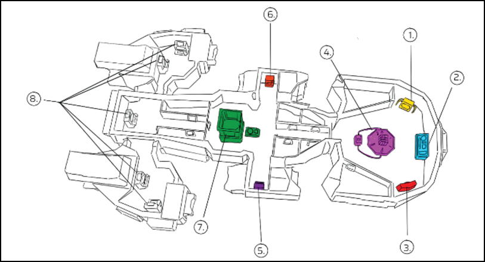
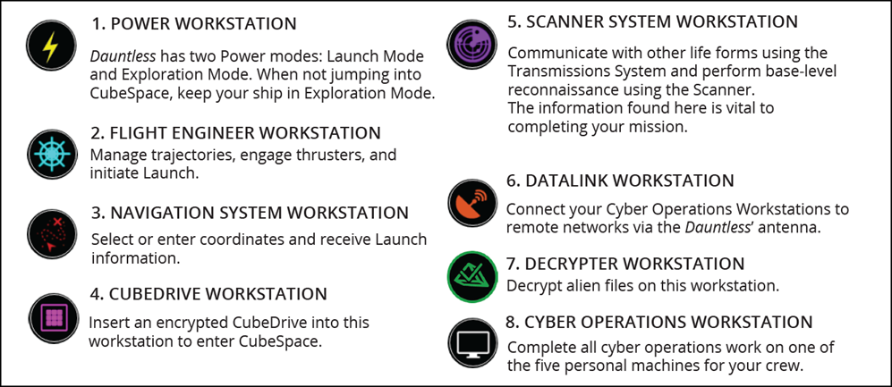
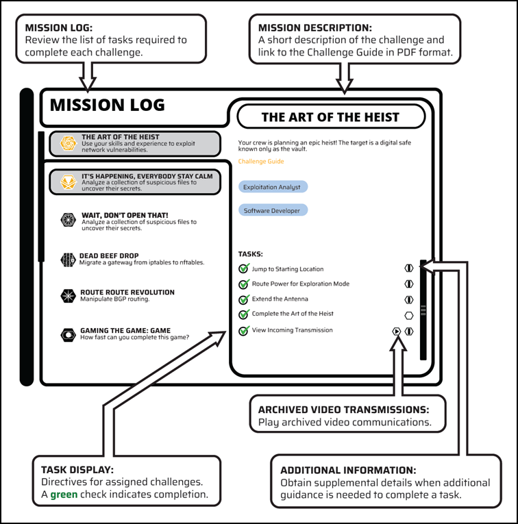
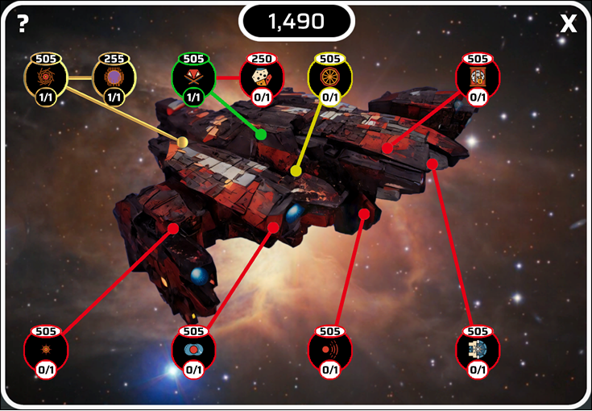
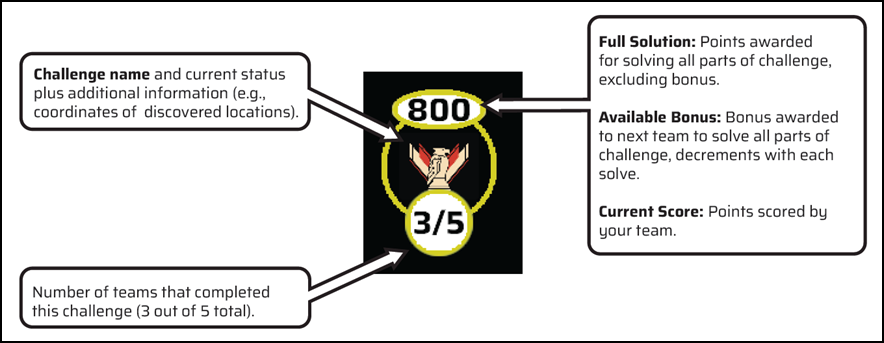
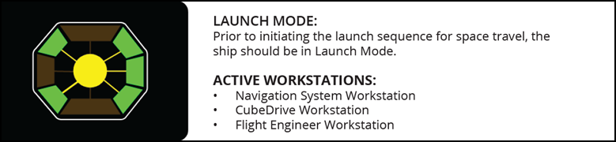
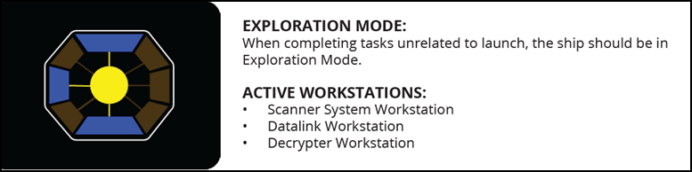
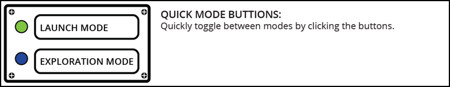
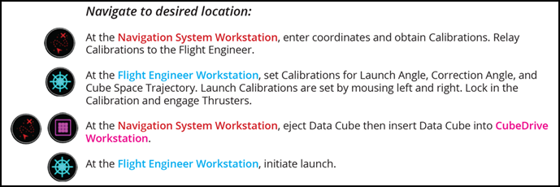
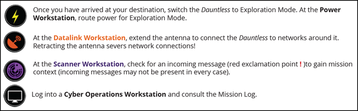

# Getting Started

[DISTRIBUTION STATEMENT A] This material has been approved for public release and unlimited distribution.

## Registration and Enrollment 2024

1. Access to the video game will depend on whether you are a federal/military employee or taking part in a workshop where accounts are being provided to you.
    
    **i.  If you have an email address ending in:** 

    .gov, .mil, csosa.fed.us, manufacturingusa.com, mfgusa.com, hearttruth.net, hearttruth.org, medlineplus.net, nlm.net, phpartners.org, thehearttruth.com, thehearttruth.net, thehearttruth.org, treasury.fed.us, usmma.edu, usna.edu, usafa.edu, afacademy.af.edu, afit.edu, nps.edu, shopvcs.com, vacloud.us, vaftl.us, vaglaid.org, vamobile.us, vapulse.net, veteranscrisisline.net, veteranshealthlibrary.org, frb.fed.us, fs.fed.us, usda.net, usps.com, westpoint.edu, or uscga.edu, 

    then you can self-register at `presidentscup.cisa.gov/id/account/confirm`. Once logged in, you will access the video game from `presidentscup.cisa.gov/gb`.
    
    **ii. If provided with an email address to log in as part of a workshop**, you will do so at `expo.cisa.gov/id` and then access the video game from `expo.cisa.gov/gb`.

2. Find the *Cubespace* card, hover over it, and then click on *Open Game.*

    

    

3. Review the highlighted game resources prior to launching the game.

    

4. Click **Enroll, Confirm, Start** (if there are available sessions in green), agree to the terms by clicking **Start** again, and  **Continue to Cubespace.**

    

    

    

    

    !!! note "Optional"
        Once enrolled, a team leader can **generate** an invitation code to provide to other members who are currently logged in so that they can **redeem** it and play as a team. See **Individual Vs Team Play Methods** section for more details.

    

5. Wait a few minutes while the virtual machines are prepared, and you are placed into the video game.

    

## Individual Vs Team Play Methods

While the game was designed to be played as a team, it can be played as an individual. If playing as an individual the player will need to interact with each workstation separately and to initiate a launch.

If playing as a team, it is recommended that team members be assigned the following tasks:

1. Crew member routes power to Launch Mode at the Power Workstation.
2. Crew member enters given coordinates at the Navigation System Workstation and relays Calibrations to crew member at Flight Engineer Workstation.
3. Crew member enters and locks Calibrations, then engages Thrusters, on Flight Engineer Workstation.
4. Crew member ejects the Data Cube from Navigation System Workstation and inserts it into the CubeDrive Workstation.

## Ship Layout

*Dauntless* is the first Earth ship to contain CubeDrive technology. This power system does not require refueling or recharging. It does require the crew to follow a specific set of steps to launch the ship into deep space.

### Workstation Descriptions

Workstations control ship functions. Navigate to workstations by selecting them in the ship. Only one user can engage a workstation at a time. The words **In Use** appear when a user is trying to access an occupied workstation.

## Heads-Up Display (HUD) Controls

The Heads-up Display (HUD) contains a variety of information about the mission and the competition. HUD controls display on the screen when you are viewing the ship. HUD controls help you navigate, manage missions, track decrypted alien codices, and guide you through the
*Dauntless*' operations.

### The Mission Log

Challenges can be completed in any sequence and completing some challenges will unlock additional bonus challenges.

## Progress

View competition milestones and metrics in the **Progress** display. Challenges in the **Progress** display are color coded to denote status: *red* indicates an incomplete challenge; *yellow*, a partially complete challenge; *green*, a complete challenge, bonus challenge unlocked. *Gold* indicates bonus challenge complete.

Bonus challenges are unlocked after completing a competition challenge. To attempt a bonus challenge, fly the *Dauntless* to the location of a supply cache. All challenges pertaining to the alien spaceship are simultaneously available when the *Dauntless* is in the Sol system (where Earth is located). **Be warned!** Traveling to another system means you will lose access to all ship challenges. Returning to the Sol system restores access to alien ship challenges. Select a mission to view the mission log.

### Progress Legend

## System Functions

Workstations on the *Dauntless* can only be used by one crew member at a time. Refer to "Workstation Descriptions" for a refresher on the functions of each workstation.

The Launch Sequence procedure must be followed to successfully launch the *Dauntless*. All launch sequence workstations have an emergency ABORT button. Press ABORT to reset the Launch Sequence.

### Power Management

Effective power management on the *Dauntless* is essential when traveling in deep space. Before and after space travel, the crew should monitor *Dauntless*' Power Workstation to ensure power is routed to the correct mode: **Launch Mode** or **Exploration Mode**.

Quickly toggle between modes by clicking the buttons.

## Launch Sequence

Strict adherence to the Launch Sequence is required to initiate deep space travel. The crew of the *Dauntless* must complete the Launch Sequence anytime CubeDrive technology is used. All challenges pertaining to the alien spaceship are simultaneously available when the *Dauntless* is in the Sol system (where Earth is located). During the course of the competition, additional locations where cache challenges are available can be unlocked. To access these cache challenges, you must travel to the remote location. **Be warned!** Doing so means you will lose access to all ship challenges during this time! Returning to the Sol system restores access to alien ship challenges.

## Launch Procedure

At the **Power Workstation**:

route power for Launch Mode...

...and navigate to the desired location.

### Navigating to the desired location

## Destination Arrival

Switch to Exploration Mode:

