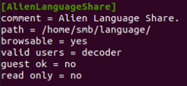
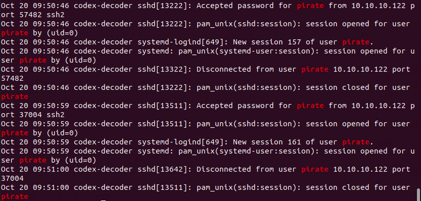
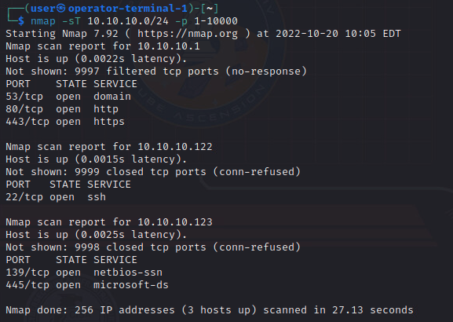

# The Red Raider Solution

[DISTRIBUTION STATEMENT A] This material has been approved for public release and unlimited distribution.

## Overview

This solution guide describes the *Red Raider* challenge: how the pirate-attacker system attacks; how challengers can prevent the attack; and, in turn, how challengers can attack the pirate, locate and retrieve the codex, and complete the challenge.

### Before you begin

The in-game mission log requires the team to *Ensure that the file "english.dict" is remotely accessible via anonymous SMB at smb://10.5.5.19:445”*.

Instructions on the Desktop of the `codex-decoder` system mention an `AlienLanguageShare` located at `/home/smb/language`. In this share is a zip file named **Galactic_STD_English_Reference.zip**. In this zip file is the file **english.dict** that must be shared with the pirates.

Check the current settings of the shares in the SMB configuration file at `/etc/samba/smb.cfg`. The `AlienLanguageShare` share is *not* remotely accessible via anonymous SMB because it lists a single valid user and guest access is disabled.



1. Open the configuration file for editing:	

	```
	sudo nano /etc/samba/smb.cnf
	```

2. Modify the lines in the screen print above to match the following by commenting out the valid user and allowing guest access:

	```
	#valid users = decoder
	guest ok = yes
	```
    
    After making these changes, save the file by pressing `CTRL-X`, type `Y`, and press `ENTER`.

3. Restart the samba service to apply the changes:

	```
	sudo systemctl reload smbd
	```

## Red Raider attack script

The pirate-attacker VM will take actions against the codex-decoder and through the decoder, the ship-critical-systems. A cronjob activates five minutes after boot that will start off the scripted attack chain.

The pirate-attacker system will continuously poll the network via ping for the appearance of the ship once it enters the deepspace network.

Once a ping is received from the ship, it will immediately try to pull down the dictionary file over SMB. It will continue trying until the dictionary file is received for as long as the ship remains in the deepspace network in the event that SMB is disabled or a file with that
exact name cannot be found in the proper location.

SMB services must be enabled and the file must be accessible on the codex-decoder for this portion to be successful. Once the file is received the grading output will be modified from "fail" to "success."

Once the dictionary file is received and the status message is changed, the pirate-attacker system will begin its attacks. It will not try to grab the dictionary file again unless somehow the dictionary file is deleted from the attack system. As far as the attacker VM is concerned, it only needs to get this file once.

The attacker will conduct an exploit against a known vulnerability in policy kit. This exploit interrupts the prompt that would be sent to a user in the GUI by killing the process midstream, thus completing the next task without interaction whether it should be allowed or not.

Using this exploit the pirates will create a root-level account on the codex-decoder under `pirate|phantom`.


The way to prevent this attack is to either disable the policy kit (not recommended, though not impossible) or disable the malicious user account. In theory, if the account is disabled, but not deleted, the attack script will fail to do anything further. Players could block the attacker IP, effectively blocking it from doing anything further. SSH connection logs/auth.log or firewall state logs should show the attacker IP address and the account name.



Now that the pirate-attacker has a root account on the system, it will attempt to pass an ssh command through the codex-decoder to the ship-critical-systems VM to shutdown and remove all Docker containers. 

This is the outward indication that you have been attacked. This may impact other challenges, such as the *Aurellian Galactic Museum* challenge, that rely on these Docker containers to be running.

The way to prevent this attack would be to block the attacker system at the source/gateway firewall, disable remote Docker commands on the ship-critical-systems VM, disable the pirate account on the codex-decoder, or set up some type of watchdog service to make sure the containers stay up.


The pirate attack process described above runs endlessly for the duration of the scenario.

- If teams remove the pirate account, the attack process attempts to add it back.
- If teams leave the deepspace network and return, the attack process tries again on a loop.
- If the attacker system loses access, it loops in place until access is restored.

Unless teams block the pirate attacker, they are continuously attacked. The real solution here is to block the attacker IP at the gateway firewall.

!!! info

	Blocking the attack is not required to solve this challenge. However, not blocking the attack while the ship is within range of the pirate's deepspace network can lead to issues with the `ship-critical-system` Docker containers as described above.

## Gaining access to the Pirate Codex

Attacking the raider-codex-decoder can be done with the same policy kit exploit, though it would be tricky to figure out this is what led to the account creation. Teams would need to research this exploit to know how to conduct it and read their own codex-decoder logs to understand it.

The easier way - and the way described in this guide - is to discover that the same `pirate|phantom` credentials added to your codex-decoder system will work on the raider-decoder's SMB share.

John the Ripper can assist. Extract the codex-decoder system's `/etc/shadow` file contents for the pirate account and the `/etc/passwd` file contents for the pirate account from the codex-decoder. I.e., *both* the `/etc/shadow` and `/etc/passwd` file contents are on the codex-decoder system.

From an operator-terminal, you can ssh to the decoder and collect those files:

- `ssh user\@10.5.5.19`
- `sudo less /etc/shadow` > copy this text out for at least the pirate account line
- `sudo less /etc/passwd` > copy this text out for at least the pirate account line

Once you have copies of these files on any operator-terminal system (Kali) and retrieve the wordlist from the ISO mounted to the operator terminals, use unshadow on the files to create a passwords.txt file:

```
unshadow password.txt shadow.txt > passwords.txt
```

Then, use John the Ripper against this file with the wordlist:

```
john --wordlist=/path/to/your/wordlist.txt passwords.txt
```


Teams should scan for, and then scan, the running services of the raider-codex-decoder system running at 10.10.10.123 which is running SMB over port 445. Teams will know that the 10.10.10.0/24 space is the operating space based on logs from the attacker's SSH connections.



SMB is running just as it is in the codex-decoder on the pirate-decoder. Access to this share allows teams to capture any files with the found credentials.

Teams can query for the running shares:


Connect and get the contents of the shares: 

```
smbclient //10.10.10.123/AlienLanguageShare -U pirate
```

```
smbclient //10.10.10.123/CodexDecoderShare -U pirate
```

Lastly, retrieve the pirate codex file:

```
smb: \> get file_codex_b.zip
```