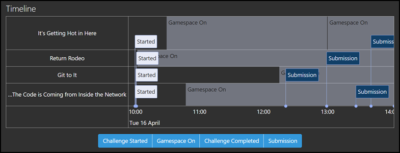
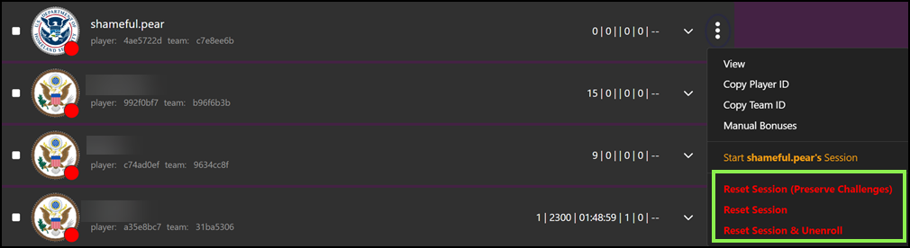

You must have the Admin Role to get to the Players screen in a game. Assuming you have been granted the appropriate role in the Gameboard, select **Admin**. Hover your mouse over an active game, then click **Players**.

**Search:** The Search feature is relative to the screen you are viewing when performing the search.

- active-only:
- complete-only:
- advanced:
- dismissed:
- comp:
- prac:
- test:
- consolidate-teams:
- time:
- rank:
- count:
- selected:
- X
- csv:
- mail:
- rerank:
- advance:

## Player View

### View Data

### Player Timeline

The **Player Timeline** is a visual representation of the sequence of session events distributed chronologically along a line. It shows the order and timing of game occurrences where events have dates and times. Events on the timeline are clickable and open a modal dialog showing extra information about the event. The **Gamespace On** event is not clickable.

Events seen on the player timeline are:

- **Challenge Started:** Shows when (date and time) a challenge has been launched. 
- **Gamespace On:** Shows when a gamespace was activated. This event is not clickable.
- **Challenge Completed:** Shows when a challenge has been completed and includes the number of attempts used and final score.
- **Submission:** Shows when a token or answer has been submitted and includes the number of attempts used, points awarded after the attempt, and any submitted answers.

!!! tip

	Selecting one of the blue buttons removes that type of event from the player timeline. If you only wanted to see **Submissions**, for example, you could remove the other event types.

### Manage Challenge Bonuses

Users who have the `Admin` role can manually add points to a player or team score in the context of a challenge. This is useful if bonus points were earned during a challenge and needed to be added.

!!! note

    A challenge must be at least started prior to awarding bonus points.

To award bonus points manually:

1. Select the **Admin** menu, hover over a gamecard, then select **Players**.
2. Expand the player view by clicking the player name, player icon, or the down arrow.
3. Select **Manage Challenge Bonuses**. 
4. In the **Manage Bonus Points** dialog, select the challenge you will add points to.
5. In **Bonus description**, provide a reason for awarding the bonus.
6. Add the number of **Points**, select **Add this bonus**. The bonus appears in the dialog, broken down by base and bonus. Continue awarding points or click **Done** when you are finished awarding points.

!!! tip

    You can also get to the Manage Challenge Bonus dialog box by clicking the "triple-dot" context menu and selecting **Manage Challenge Bonuses**.

### Unenroll and Reset Session

In the Player view context menu (the "three vertical dots") you'll notice four different menu items: **Unenroll** or **Reset Session (Preserve Challenge)**, **Reset Session**, and **Reset Session & Unenroll**. Which item you see depends on whether the player or team has started a game session or not. Only users with the `Registrar` or `Admin` roles can unenroll players/teams or reset their sessions.

!!! info
        A "session" is when a game is started and challenges can be deployed and solved.

- **Unenroll:** If a player has registered, but has not started a session, you can *unenroll* them from the game. They will need to re-enroll to play again.
- **Reset Session (Preserve Challenges):** If a player has registered, and has started playing the game (i.e., they have a game session), you can reset their session *and not* archive any challenges, started or completed. Use of this option should be limited to very specific situations like testing and QA. 
- **Reset Session:** If a player has registered and has started playing the game (i.e. they have a game session), you can reset their session. This deletes any challenge data they generated while playing but, leaves enrollment and team membership intact. If they wish to play again, they'll need to start a new session.
- **Reset Session & Unenroll:** If a player has registered, and has started a session, you can *reset* their session and *unenroll* them from the game. Players will need to re-enroll to play again. Teams are essentially dissolved and will need to reform and re-enroll to play. This is the same functionality as when a player unenrolls from the game lobby or resets their session (when enabled by an admin).

Players can also unenroll themselves from the game lobby or reset their session if the admin setting **Allow Reset** is set to **Allowed** for their game. For the player perspective, see: [Participating in a game](participating.md).