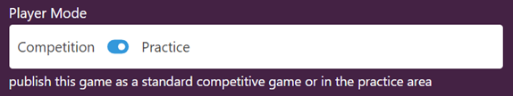

# Admin Practice Area

Gameboard administrators configure the global Practice Area context here. In the main navigation bar, click **Admin**, then **Practice Area**.

## Practice Page Greeting

The text here appears on the Practice Area page and introduces players to the Practice Area. The greeting is authored in Markdown, which allows you to create a nicely formatted message. Customize the greeting to meet your needs.

More information about Markdown, including the syntax guide, can be found at [markdownguide.org]().

## Suggested Searches

## Certificate Template

Admins configure the certificate template here by entering HTML into the **Certificate Template** field. Players save certificates in PDF format for each practice challenge they fully complete. More information on certificates can be found in the [Playing in the Gameboard](./participating.md) documentation under "The Profile screen" heading.

For your convenience, here are several variables you can include in your template to display information about the player's performance on a practice challenge.

- `{{playerName}}`: The player's approved username
- `{{score}}`: The player's score on the challenge
- `{{date}}`: The date the player completed the challenge
- `{{challengeName}}`: The name of the challenge
- `{{season}}`: The season the challenge was originally played in competitive mode
- `{{track}}`: The track the challenge was originally placed in competitive mode
- `{{time}}`: The amount of time the player spent solving the challenge

## Session Limits

Admins use these controls to set limits on practice sessions, including:

- **Maximum Concurrent Users:** How many players can be active at once
- **Default Session Length:**  How long in minutes practice sessions are by default
- **Maximum Session Length:** How long in minutes the maximum length a single practice session lasts

## Player Mode

In addition to the configuration required in the Admin Practice Area, the **Player Mode** must be set to **Practice** to publish a game in practice mode. Player Mode is a game setting found in **Admin**, hover over a game card, and select **Settings**. Expand **Settings**.

*In the screen print below, Player Mode is enabled.*

!!! tip

    Gameboard administrators who are looking for reports on the Practice Area can find them by clicking **Reports** in the main navigation, then selecting the **Practice Area** card.