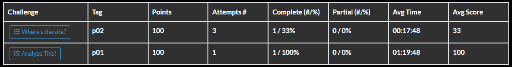
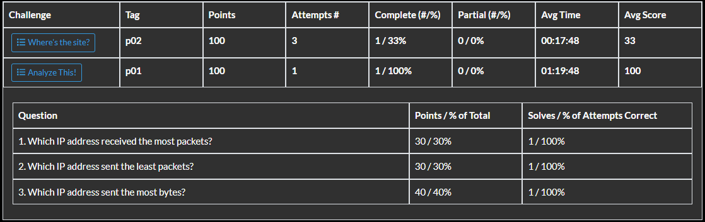

# Reports

## User Reports

**Export User or Player Report to CSV:** Allows you to export user or player statistics depending upon which icon you select as a comma-separated values file. From the .csv file, you can perform more detailed analysis.

**Users:** Counts of users *enrolled* in the game and *not enrolled* in the game and totals. "Not enrolled" means registered on the identity server, but not yet enrolled in a game.

**Players:** Count of players by games.

## Board Reports

Select a gameboard from the dropdown. 

**Export Board or Sponsor Report to CSV:** Allows you to export player/team counts by sponsor statistics or user counts by sponsor depending upon which icon you select as a comma-separated values file. From the .csv file, you can perform more detailed analysis.

**Board:** Counts of players and team per sponsor. 

**All Sponsors:** Shows user count by sponsor.

## Challenge Reports

Select a gameboard from the dropdown. You have two export-to-CSV options:

**Export Challenge Stats to CSV:** Allows you to export high-level statistics per challenge per game.

**Export Challenge Details to CSV**: Allows you to export additional challenge details --- such as individual question statistics per challenge per board.

The screen capture below shows two challenges on a gameboard in the **Challenge Stats** view.

 In the **Challenge** column, select a challenge to view the **Challenge Details**. The challenge *Analyze This!* is seen in the Challenge Details view below.

## Feedback Reports

Feedback reports contain player responses to surveys created by game administrators. Feedback functionality -- including Feedback Reports -- is documented in the [Feedback Feature](admin-feedback-form.md) guide.

## Support Reports

## Participation Reports