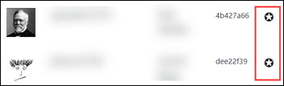
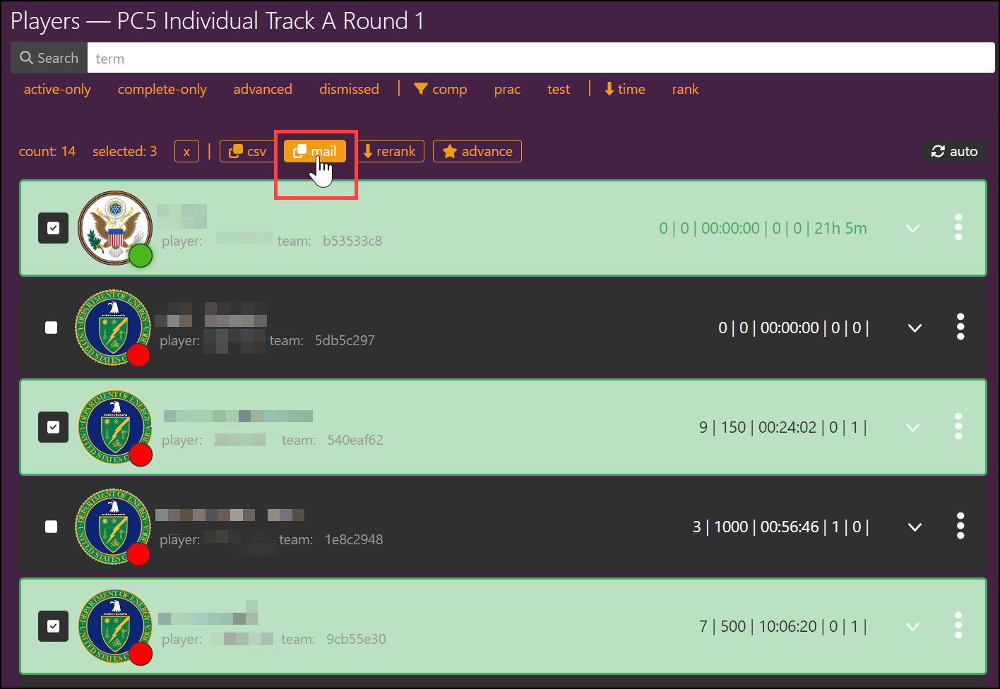

!!! Warning "" 
	 :warning: <strong>This documentation site has been deprecated and will no longer be updated as of 11/11/24. Foundry applications are now part of the [Crucible Framework](https://cmu-sei.github.io/crucible/). The Identity applicaiton is no longer supported in the Crucible Framework.</strong>

# Accounts

!!! note
    The **Accounts** tab is only for administrators.

This is where Identity administrators track Identity users. Things administrators can do here include:

- Searching for user accounts
- Creating new accounts
- Creating override codes
- Sending email to users
- Enabling and disabling accounts
- Changing an account's *role*
- Generating a passcode
- Adding an email address

*Administrator* and *manager* roles are denoted by a star in the Identity user interface.

## Update an existing account

Use the **Search** field to find the account you want to update.

- **State:** Enable or Disable an account.
- **Role:** Change an account's role to *member* or *manager*. A *member* can only act on their own account (i.e., update profile, configure 2FA). A *manager* can act on other accounts (i.e., enable or disable, generate authorization codes, add email address, create new accounts).
- **Code:** Generate an authorization to provide to an account trying to log into Identity.
- **Email:** Add an additional email address to the account.
- **Login:** Useful when users are having trouble accessing the environment because it provides the user's IP address.

!!! info
    There is an *administrator* role available; however, it must be enabled in the database. Contact your Identity administrator for help with this role.

## Create a new account

At the bottom of the Accounts screen, click **New Account**. Enter the account information like this: `First Last <email@some.site>`. You can enter an initial password here; but it's recommended to leave that field blank. Users can use the **Reset my password** option at their first login attempt.

## New Override Code

At the bottom of the Accounts screen, click **New Override**. Add a global code for registration and password resets in a "no email" deployment. With a global code, there is no need to send and receive codes via email or set up 2FA on a mobile device.

!!! info
    Reminder that you must be an *admin* or *manager* in order to create accounts and override codes.

## Send a Mailer

Identity server allows an administrator to send email messages to registered accounts on Identity. At the bottom of the Accounts screen, click **Mailer**. There are two ways to define who emails are sent to.

- **Recipient(s):** Enter `@here` to send the email every account on Identity; enter a single email address to send an email to a specific account; or, delimit several addresses using a `;` to send an email to specific accounts.
- **Recipient Groups:** Get a list of players from the Gameboard, for example, and paste that list in `json` format into the Recipient Groups field. Follow the procedure below to get the `json` syntax.

The remaining fields -- **Cc**, **Bcc**, **From**, **Subject**, and **Message** -- all function as expected in any email application. If the **From** field is left blank, Identity uses the email address defined in the `AppMail__From:` configuration value in the `identity.values.yaml` file. This allows for professionally formatted email to be constructed and sent.

The **Message** field accepts MJML (Mailjet Markup Language). MJML is a markup language created to make coding responsive email easier.

### Recipient Groups (json) Mailer

Assuming that you have the appropriate Identity and Gameboard permissions:

1. In Gameboard, click **Admin** menu in the top-right corner.
2. Hover over a gamecard, and select **Players**. You are presented with a list of players (competitors) in that particular game.
3. Click **mail**. This copies the `json` syntax for Identity for *all* the players in the game. If you don't want all the players, select the checkbox next to a player name. When you click **mail** now, only the selected players are added to the `json` syntax. 
4. In Identity, Accounts, Mailer: paste the `json` into the **Recipient Groups** field.
5. Complete the remaining fields on the Mailer form and click **Send**. 

*In the screen print below, several players in the game are selected. Clicking `mail` copies the `json` syntax for the Mailer in Identity. Player information has been obscured.*

