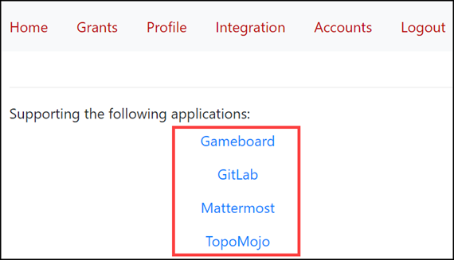

!!! Warning "" 
	 :warning: <strong>This documentation site has been deprecated and will no longer be updated as of 11/11/24. Foundry applications are now part of the [Crucible Framework](https://cmu-sei.github.io/crucible/). The Identity applicaiton is no longer supported in the Crucible Framework.</strong>

# Identity Home

From the Home tab, launch any of the affiliated applications such as Gameboard and TopoMojo.

*In our example, the applications associated with Identity are highlighted.*