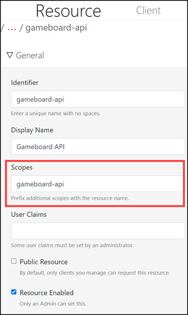
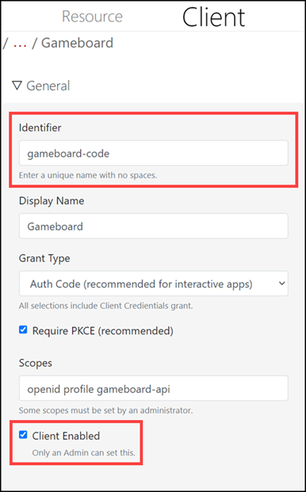

# Integration

If contributing an application to this application ecosystem, or if developing a client, use this area to define any API resources you want to protect, and the client specifications needed. Some features may need administrator approval.

A *client* is an application that wants to use Identity Server to provide authentication. Using Gameboard as an example: when logging into Gameboard, Gameboard is a client asking Identity to provide authentication services. A *resource* is protected information or functionality that an application exposes to authenticated users. Gameboard uses a resource to expose a user profile to it (Gameboard).

In keeping with our Gameboard example:

There may be a **gameboard-api** resource requesting access to the `gameboard-api` (the *Scope*). See screen print 1 below. 

There would also be a corresponding *client* for Gameboard. This is what the Gameboard application uses when identifying itself to the Identity server. See screen print 2 below. The OpenID Identifier `gameboard-code` authenticates to the Identity server. **Scopes** asks for access to `openid`, the user's `profile`, and access to the `gameboard-api` resource.

When **Client Enabled** is checked by an Admin, the client (application) is available as a URL on the Home tab.

*Screen print 1: Resource*

*Screen print 2: Client*

