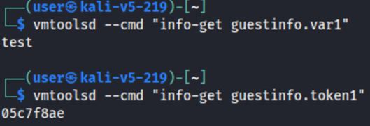

# Challenge

The **Challenge** page in the Topo workspace is used when both Gameboard and TopoMojo are integrated to execute a cyber competition. More information on linking those two applications together can be found elsewhere in the Foundry documentation. The Challenge page is where you create random key/values, embed them in a *gamespace* at deploy time, and ask questions of competitors (players).

## Transforms

*Transforms* allow you to define dynamic variables that are generated based on certain criteria or types. Transforms are also a key/value pair definition – the *key* is the name of your transform and the *value* is the type of the transform.  The screen print below shows a transform named “token1” that will have a value of 8 random hexadecimal characters. 

*Screen print 1:*

To access transforms, use the referenced "*double-pounder-key* (`##key##`)" notation. When TopoMojo deploys a gamespace, the engine generates the random values for all transforms, looks for double-pounder-keys, then replaces them with the randomly generated values for that deployment.

Any of the sections on the Challenge tab (e.g., Transforms, Markdown, Questions, Answers) can contain *double-pounder-keys* that will be replaced with transform values at deploy time. You can also use transform *double-pounder-keys* in the **Guest Settings** field of a template to inject random variables into VM guest info variables when deploying a gamespace (transforms aren’t generated when deploying workspace VMs, so the value of the variable will be the *double-pounder-key*). 

The screen print below shows the Guest Settings of a VM template configured to use two guest info variables: `var1` and `token1`. `Var1` has a value of “test” and `token1` will have a random 8-character hexadecimal string assigned when a gamespace is deployed. 

*Screen print 2:*

Guest info variables can be accessed from a Gamespace VM by using VMware Tools such as `open-vm-tools`and the `vmtoolsd` command. See [Open VM Tools](https://docs.vmware.com/en/VMware-Tools/12.3.0/com.vmware.vsphere.vmwaretools.doc/GUID-8B6EA5B7-453B-48AA-92E5-DB7F061341D1.html) and [VMware Tools daemon help](https://helpmanual.io/help/vmtoolsd/).

*Screen print 3:*

## Markdown

## Variants

A *variant* describes a different version of a challenge. Variants can contain different ISO attachments, different virtual machines, and different questions and answers. Each time a challenge is deployed, a variant is randomly selected for the deployment. For example, two competitors can attempt the same challenge, but one competitor may receive *variant #1* and the other competitor may receive *variant #2*.  When creating a challenge using variants, make sure all variants test the same competitor skills at the same difficulty level. That is, variant #1 should test the same skills as variant #2 and one variant shouldn't be harder to solve than another variant.

### Show Variant Detail

**Detail:**

**Clone:** 

**Remove:**

**Markdown:**

**Iso:** TopoMojo does allow you to attach a variant-specific ISO file to "target" templates. To attach an ISO file  to a subset of VMs only when deployed in a gamespace:

1. On the **Challenge** tab, enable **Show Variant Detail**. 

2. Under **Iso**, select an ISO file. This is the file you'll attach to the VM target.

3. Under **Targets**, specify the VMs that should have the ISO attached when a gamespace is deployed. 

A different ISO can be defined for each variant. 

**QuestionSet:**
