About TopoMojo
==============

TopoMojo is the SEI's Cyber Workforce Development team's latest web application for creating and delivering cybersecurity training labs and
exercises. With TopoMojo, users can build and deploy labs in a highly-isolated and secure virtual-machine environment.

TopoMojo allows for the same functionality and connectivity that users would experience with real, physical devices. Network topologies can
utilize not only IP and Ethernet, but also custom protocol solutions, like 802.11 wireless packet simulation.

New topologies can be rapidly deployed using existing templates or built from the ground up with user-provided ISO's and VM specifications.

This *Quick Start Guide* introduces users to the TopoMojo environment and provides information necessary to launch existing labs and create
new topologies.

Browsing for existing labs
--------------------------

Once logged in, you can browse for existing TopoMojo labs that have been created previously.

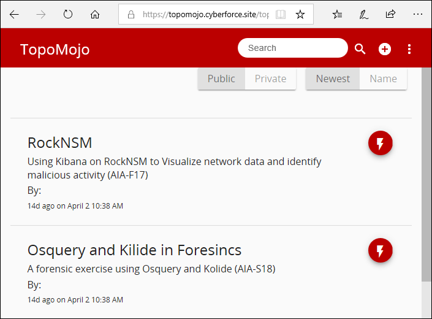{width="5.447916666666667in"
height="4.0184208223972in"}

### Using the Search field

Enter terms into the **Search** field. TopoMojo automatically searches for a workspace that matches your terms.

Sort by Newest or Name
----------------------

Select **Newest** to sort the labs by how recently they were created. Select **Name** to sort the list of labs alphabetically by name.

Previewing an existing lab
==========================

To preview an existing lab, click the **Preview** (red lightning bolt) icon.

{width="0.48in" height="0.51in"}

First, you are presented with a lab guide authored as an HTML page. Lab guides are written using Markdown, a simple and easy-to-use markup
language. For more information on Markdown in this guide, see the "Lab Document" section below.

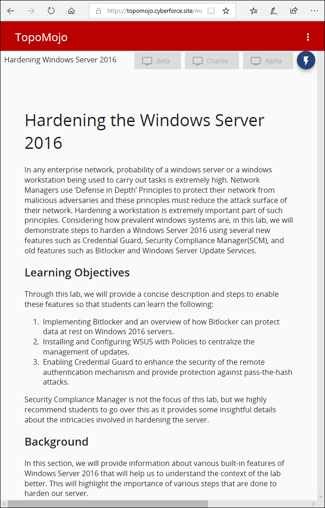{width="3.66in" height="5.7in"}

Toggling the background theme
=============================

By default, white is the TopoMojo background color. If white is too bright, you can toggle TopoMojo's dark theme.

1.  In the top-right corner, click the three dot ( **...** )icon.

2.  Then click Theme.

> 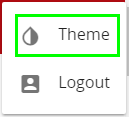{width="1.02in" height="0.92in"}

The background changes to black.

Launching an existing lab
=========================

At the top of this page, in the right corner, click the **Launch** icon (blue lightning bolt) to deploy the virtual machines for this lab.

{width="0.3541666666666667in"
height="0.3233694225721785in"}

It may take a few seconds for the VM buttons to turn active.

Inactive VMs are "grayed out".

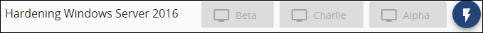{width="5.35in" height="0.37in"}

Active VMS are not.

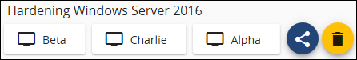{width="3.51in" height="0.59in"}

Click one of the machines to start it. The virtual machine console opens in a separate browser tab. In the screen capture below, the gear icon on
the virtual machine tab is called out.

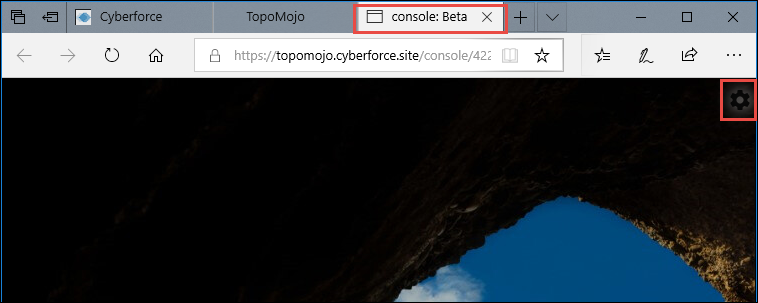{width="5.96in" height="2.38in"}

Console sidenav menu
--------------------

Selecting the gear icon launches the sidenav component. The sidenav menu contains the following items: **Control**, **Layout**, **Change
Network**, **Change ISO**, **Upload ISO**, and **Vm Question**.

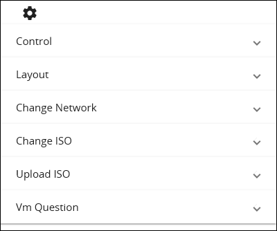{width="3.13in" height="2.61in"}

**Control:** Contains the keyboard command for **Ctrl+Alt+Del**. Select the Ctrl-Alt-Del icon to get the login prompt for the virtual machine.

**Layout:** Contains the following options to resize the layout:

-   **Scale:** Keeps the virtual machine the same size within the
    browser window.

-   **Fullscreen:** Expands virtual machine to full screen within the
    browser window.

-   **Keyboard:**

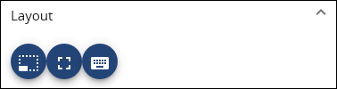{width="2.95in" height="0.78in"}

**Change Network:** Allows you to change the network your virtual machine is attached to. For example: dpg-topomojo or lan.

**Change ISO:** Allows you to change an ISO on your virtual machine.

**Upload ISO:** Allows you to upload files from your system to TopoMojo to include in your lab. Click **Browse**, then navigate to where the
file you want to update is stored. Toggle the Public switch to make the files public if you think they will be useful to others.

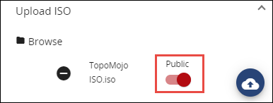{width="3.02in" height="1.14in"}

**Vm Question:** If the virtual machine becomes unresponsive, you may be required to answer a question.

Ending a session
================

To end a session, click the yellow **trash can** icon. Click it again to **Confirm**.

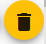{width="0.4791065179352581in"
height="0.45827646544181977in"}

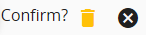{width="1.5206430446194226in"
height="0.36453740157480313in"}

Building a new workspace
========================

Public vs Private
-----------------

The Private workspace area allows you to build a project before publishing it to the Public area.

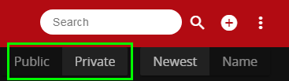{width="3.0520833333333335in"
height="0.8565791776027997in"}

Select **Public** or **Private**.

In the top navigation bar, click **New Workspace**.

{width="0.38536854768153983in"
height="0.37495297462817145in"}

The **Name** and **Description** fields appear. You must complete both
fields for the **Create** icon to be enabled.

1.  Enter a **Name** and short **Description** for your topology. You
    can always edit these fields again later.

2.  Click **Create**.\
    {width="0.4791065179352581in"
    height="0.4895220909886264in"}

The Workspace interface
-----------------------

The workspace interface contains four sections: Template Selector, File Uploader, Lab Document, and Workspace Settings.

### Template Selector

Template Selector allows you to add virtual machine templates to your workspace. The templates here are "starting point" virtual machines that
you can customize to build your lab. There are blank disc templates for installing your own operating system plus other VMs with operating
systems pre-installed.

To select a template:

1.  Under Template Selector, select a template (for example, **blank-10g**). The new template is added above the template selector.
    
2.  Continue to add the templates you will need for your topology.

3.  Rename each template that you add to your topology. Each template
    must have a unique name.

4.  Click the down arrow to expand the template(s) to make changes.

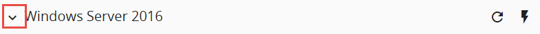{width="6.5in" height="0.41388888888888886in"}

The table below explains the fields in the vm template.

+-----------------+---------------------------------------------------+
| **Field**       | **Action or Description**                         |
+=================+===================================================+
| Name            | Click in the Name field to edit the name.         |
|                 | Remember that the name should be unique within    |
|                 | the workspace.                                    |
+-----------------+---------------------------------------------------+
| Description     | Click in the Description field to edit the        |
|                 | description. Description should contain           |
|                 | credentials for the virtual machine and the       |
|                 | purpose of the virtual machine.                   |
+-----------------+---------------------------------------------------+
| Networks        | The Networks fields allows you to add a space-    |
|                 | delimited list of networks where the virtual      |
|                 | machines connect. These names should be the same  |
|                 | for all systems in your lab that need to connect  |
|                 | to the same network.                              |
+-----------------+---------------------------------------------------+
| ISO             | The ISO section enables you to attach an ISO      |
|                 | image to your virtual machine.                    |
+-----------------+---------------------------------------------------+
| Hidden          | Hides a specific VM from being accessible by the  |
|                 | person completing the lab. This is useful for     |
|                 | systems like a DHCP server that do not require    |
|                 | user interaction.                                 |
+-----------------+---------------------------------------------------+
| Unlink          | Creates a new copy of the template that can be    |
|                 | saved and customized. This is needed for any      |
|                 | virtual machine that will not use the default     |
|                 | disk                                              |
|                 |                                                   |
|                 | included with the template.                       |
+-----------------+---------------------------------------------------+
| Save Settings   | Saves the settings you just entered.              |
+-----------------+---------------------------------------------------+
| Delete Template | Deletes the template.                             |
+-----------------+---------------------------------------------------+

Click the **Deploy** (lightning bolt) icon to deploy that virtual machine into your workspace.

Once the machine is in the appropriate state, click the **Save** icon (floppy disk) for the template to save your work to the disk. The table
below explains the icons used in the deployed virtual machine.

  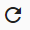{width="0.31246062992125984in" height="0.31246062992125984in"}                                                                                         Refresh      Refreshes the VM instance.
-------------------------------------------------------------------------------------------------------------------------------------------------------------------------------- ------------ -----------------------------------------------------------------------------------------------------------
  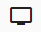{width="0.4270297462817148in" height="0.3332917760279965in"}                                                                                           Console      Opens the console for the virtual machine.
  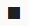{width="0.3020450568678915in" height="0.27079943132108486in"}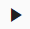{width="0.31246062992125984in" height="0.3020450568678915in"}   Stop/Start   
                                                                                                                                                                                   Save         Saves your work to the disk.
  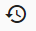{width="0.37495297462817145in" height="0.32287620297462816in"}                                                                                         Revert       Reverts to your last saved state.
  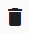{width="0.3020450568678915in" height="0.34370734908136485in"}                                                                                          Delete       Deletes a running VM instance. Before you click Delete, make sure you have saved any changes to the disk.

File Uploader
-------------

File Uploader allows you to upload files from your system to TopoMojo to include in your lab. If your files aren't already in an ISO file,
TopoMojo wraps them in an ISO after upload. Make the files public if you think they will be useful to others.

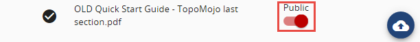{width="4.74in" height="0.48in"}

Lab Document
------------

Lab Documents is where you write the manual that corresponds with your lab. Click the **Edit Doc** icon to open the lab document.

{width="0.24996828521434822in"
height="0.2916305774278215in"}

Lab guides are authored in Markdown. More information about Markdown, including the syntax guide, can be found at **markdownguide.org**.
Authoring in Markdown enables you to create a nicely formatted guide without writing HTML.

To insert an image into your document:

1.  Click the **Image Manager** icon in the top-right corner.

2.  Then click **Browse**.

3.  After browsing to upload an image, click **Save** in the Image
    Manager. You should see a preview of the image.

4.  Click the preview to place the appropriate markdown text onto the
    clipboard, then just paste it into the document and edit as needed.

In the screen capture below, Markdown is in the left pane and what a user sees is the right pane.

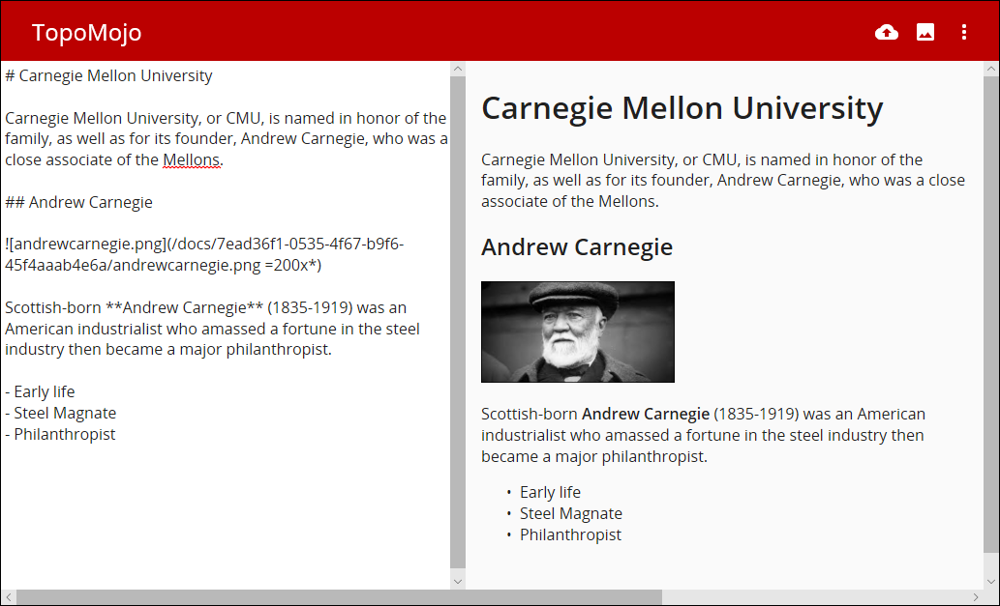{width="5.96in" height="3.62in"}

Workspace Settings
------------------

Workspace Settings is where you to edit the metadata for your lab and publish it when you're ready.

+------------------+--------------------------------------------------+
| **Field**        | **Action or Description**                        |
+==================+==================================================+
| Name             | A short name for your workspace. What appears    |
|                  | here is what you entered when you initially      |
|                  | created the new workspace.                       |
+------------------+--------------------------------------------------+
| Description      | A short description for your workspace. What     |
|                  | appears here is what you entered when you        |
|                  | initially created the new workspace.             |
+------------------+--------------------------------------------------+
| Author           | Add the names of others who may have assisted    |
|                  | you with the lab to the author field.            |
+------------------+--------------------------------------------------+
| External Doc URL | Link to a document that is outside of TopoMojo.  |
|                  | Leave it blank if you are using the Lab Document |
|                  | feature in TopoMojo.                             |
+------------------+--------------------------------------------------+
| Published        | Toggle Published to make your lab Public and     |
|                  | available in the initial TopoMojo screen.        |
+------------------+--------------------------------------------------+
| Members          | To share your workspace with others right-click  |
|                  | the Share button at the bottom of the page and   |
|                  | select **Copy link address**. You can paste the  |
|                  | link into an email and send.                     |
|                  |                                                  |
|                  | {width="0.2916305774278215in" |
|                  | height="0.2916305774278215in"}                   |
+------------------+--------------------------------------------------+

When you are finished editing the Workspace setting, click **Save
Settings**

Workspace Limits
----------------

When building new workspaces you may see this message.

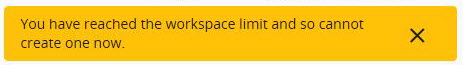{width="4.822916666666667in"
height="0.6770833333333334in"}

TopoMojo only allows two workspaces to be created by a user.

Editing an existing workspace
=============================

After publishing, your lab appears in the Public space of TopoMojo with the other labs. Click the **Build** (wrench) icon to edit your existing
workspace.

{width="0.3333333333333333in"
height="0.341084864391951in"}

Clicking the Build icon takes you to the workspace editor with Template Selector, File Uploader, etc.

Deleting a workspace
====================

To delete an existing workspace:

1.  Locate an existing lab.

2.  Click the **Build** (wrench) icon to edit the workspace.

3.  Under Workspace Settings, click **Delete Workspace**.\
    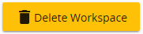{width="1.885181539807524in"
    height="0.45827646544181977in"}

4.  Click **Confirm?**

The workspace is deleted.
